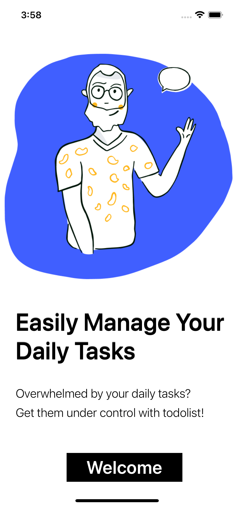
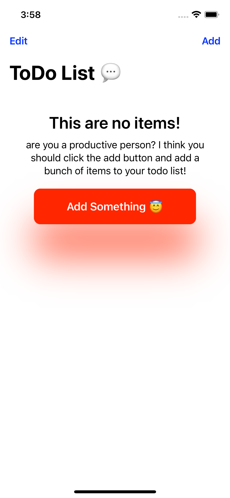
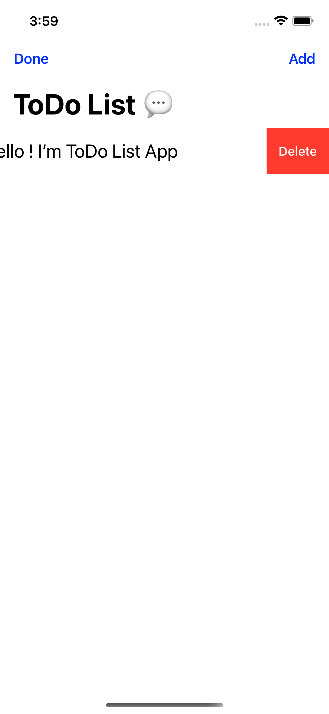

# Do Stuff - ToDo List App
Easily Manage Your Daily Tasks . . . !

<table>

<tr>

  
 

  #### Full source code for the SwiftUI Todo List. The project uses MVVM architecture and UserDefaults to persist data.

</tr>
	<tr>
		<td align="center">
				
		</td>
    <td align="center">
				
		</td>
    <td align="center">
				
		</td>
    <td align="center">
				
		</td>
    <tr>
  		<td align="center">
  				
  		</td>
      <td align="center">
  				
  		</td>
      <td align="center">
  				
  		</td>
      <td align="center">
  				
  		</td>
	</tr>
</table>
